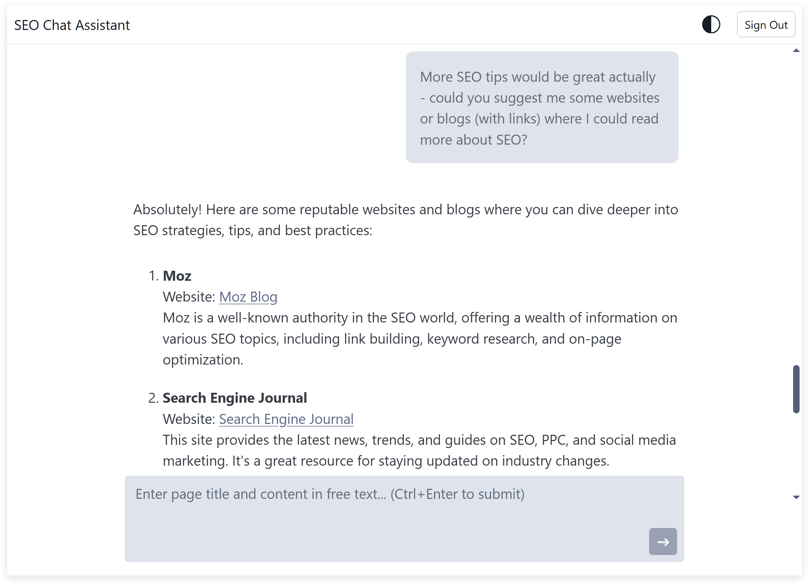

# SEO Chat Assistant

## User Interface




## Project Structure

```
seo-chat-assistant/
├── backend/                          # Backend project (Fastify)
│   └── src/
│       ├── firebase/
│       ├── routes/
│       ├── services/
│       ├── types/
│       ├── index.ts                  # Local development server
│       └── server.ts                 # API server configuration
│
├── frontend/                         # Frontend project (Next.js)
│   └── src/
│       ├── common/
│       ├── components/
│       ├── lib/
│       ├── pages/
│       ├── styles/
│       └── utils/
│
├── functions/
│   ├── lib/
│   ├── build.js                      # bundles API server for GCP deployment
│   └── index.js                      # exposes API endpoints via Firebase Cloud Functions
│
├── firebase.json                     # Firebase deployment config
├── firestore.indexes.json            # Firestore indexes config
├── firestore.rules                   # Firestore rules config
└── package.json                      # npm workspaces config
```

### Main Folders and Files

- **backend/**: Node.js Fastify API, Firebase integration, AI logic (LangChain/OpenAI), and type definitions.
- **frontend/**: Next.js React app for user interface, authentication, and chat.
- **functions/**: Firebase Cloud Functions entrypoint, server build script, and bundled server code.
- **firebase.json, firestore.*.json, firestore.rules**: Firebase project configuration files.

---

## Tech Stack

### Backend
- [**Node.js**](https://nodejs.org/): JavaScript runtime for building scalable server-side applications.
- [**Fastify**](https://www.fastify.io/): High-performance web framework for Node.js, used for building APIs.
- [**Firebase Admin SDK**](https://firebase.google.com/docs/admin/setup): Provides server-side access to Firebase services like Auth and Firestore.
- [**LangChain**](https://js.langchain.com/docs/): Framework for building applications with large language models (LLMs), used for conversational AI logic.
- [**OpenAI**](https://platform.openai.com/): Provider of advanced AI models (GPT-4/GPT-4o) for natural language understanding and generation.
- [**TypeScript**](https://www.typescriptlang.org/): Superset of JavaScript that adds static typing for safer and more maintainable code.
- [**Firebase Functions**](https://firebase.google.com/docs/functions): Serverless platform for running backend code in response to HTTP requests and events.
- [**esbuild**](https://esbuild.github.io/): Ultra-fast JavaScript bundler and minifier, used to package backend code for deployment.

### Frontend
- [**Next.js**](https://nextjs.org/): React-based framework for building fast, scalable web applications with server-side rendering and static export.
- [**React**](https://react.dev/): JavaScript library for building user interfaces with reusable components.
- [**SCSS Modules**](https://sass-lang.com/): CSS preprocessor for writing modular, maintainable styles with variables and nesting.
- [**Firebase JS SDK**](https://firebase.google.com/docs/web/setup): Client-side library for interacting with Firebase services (Auth, Firestore) from the browser.
- [**TypeScript**](https://www.typescriptlang.org/): Adds type safety to frontend code for better reliability.

---

## Setup

### Prerequisites
- Node.js (v20+ recommended)
- npm (v9+ recommended)
- [Firebase CLI](https://firebase.google.com/docs/cli) (for deployment)

### Dependencies

- To install all dependencies for the project, including all workspaces (backend, frontend, functions), run the following command from the project root:

```bash
npm install
```

- To install Firebase CLI, required for cloud deployment, run the following command:

```bash
npm install -g firebase-tools
```

### Configuration & Credentials

> [!IMPORTANT]
> **Never commit `.env` files or service account keys to your repository.**

#### Environment Files

Both `backend` and `frontend` have `.env.template` files. Copy and rename them to `.env.local` and set the required environment variables before running the project.

#### OpenAI

Obtain an **OpenAI API Key** from https://platform.openai.com/ and set `OPENAI_API_KEY` in the `backend/.env.local` file. This is required for backend AI agent integration.

#### Firebase

Firebase project configuration is located in `firebase.json` in the root folder.

- For local development, download **Firebase Service Account** JSON from Firebase Console. Set the path in the `backend/.env.local` file:

  ```env
  GOOGLE_APPLICATION_CREDENTIALS=/absolute/path/to/serviceAccount.json
  ```

- For cloud deployment (Firebase Cloud Functions), the built-in service account is used automatically — no need to upload a key.

- For the frontend integration to function properly, configure the related Firebase environment variables in `frontend/.env.local` (available in the project details in Firebase Console):

  ```env
  NEXT_PUBLIC_FIREBASE_API_KEY=your-api-key
  NEXT_PUBLIC_FIREBASE_AUTH_DOMAIN=your-app.firebaseapp.com
  NEXT_PUBLIC_FIREBASE_PROJECT_ID=your-project-id
  ```

#### Firestore

Firestore rules and indexes are located in `firestore.rules` and `firestore.indexes.json`, respectively.

#### Backend API Integration

To configure a custom backend server port in set the `SERVER_PORT` environment variable in `backend/.env.local` and update `NEXT_PUBLIC_BACKEND_API_URL` in `frontend/.env.local` accordingly.


### Command Reference

| Description                                     | Command             |
|-------------------------------------------------|---------------------|
| Build both backend and frontend                 | `npm run build`     |
| Build only backend                              | `npm run build:be`  |
| Build only frontend                             | `npm run build:fe`  |
| Start backend (local dev)                       | `npm run start:be`  |
| Start frontend (local dev)                      | `npm run start:fe`  |
| Start both backend and frontend (local dev)     | `npm run start`     |
| Deploy everything (API, website, Firestore)     | `npm run deploy`    |
| Deploy only backend (API, Firestore)            | `npm run deploy:be` |
| Deploy only frontend (website)                  | `npm run deploy:fe` |

> [!NOTE]
> - The backend build bundles the Fastify server for Firebase Cloud Functions deployment.
> - The frontend build output will be in `frontend/dist` (static export).
> - Each deployment script automatically builds the respective sub-project before deploying.
> - The frontend and backend can be run independently for local development.

---

## AI Agent Integration

- **Model**: OpenAI GPT-4o
- **Library**: LangChain (conversation management, prompt templates)
- **Configuration**: Set `OPENAI_API_KEY` in `backend/.env.local`.
- **Usage**: The backend exposes endpoints for chat, the frontend interacts via API.
